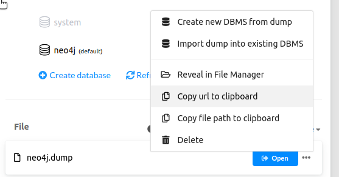
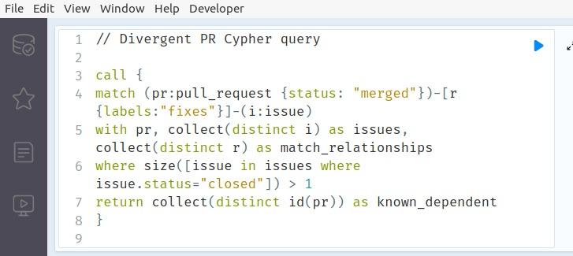
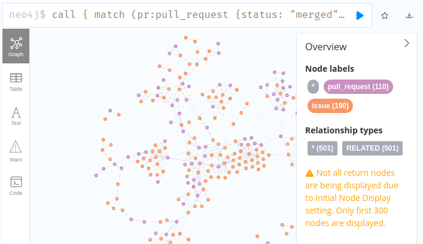

# Installation

1. Clone project with Git and install dependencies (see [REQUIREMENTS.md](./REQUIREMENTS.md)). For convenience, a VirtualBox image has been provided that automates this step (user is `fse2024`, password is `pass`). Note that Neo4j downloads as an AppImage on Linux, so you will need to run `chmod +x ./path-to-appimage.AppImage && ./path-to-appimage.AppImage` in order to run Neo4j. On the VirtualBox image, the Neo4j AppImage is located in the `~/Downloads` folder and the project has been cloned into the `~/pr-issue-topology-project` folder. If using the VirtualBox image, make sure to `source venv/bin/activate` to activate the virtual environment with all the Python dependencies.
2. Download and import the data dump into Neo4j. A copy of the data dump is available [here](https://osf.io/3kexy). This can be done by clicking '+ Add' > 'File' > select the data dump, then clicking the ellipsis beside the `neo4j.dump` file that appears below in the `File` section and selecting 'Create new DBMS from dump'. Make a note of the password you use for later. Click 'Start' beside the new DBMS to start the server. This has already been done in the VirtualBox image, and the password is `testtest`.
   
3. To check that the data was imported correctly, click 'Open' beside the new DBMS. Go into the `cypher_scripts` folder in the project and pick a Cypher query to run. Copy-paste its contents into the query box in Neo4j and click the play button.
   
   You should be able to see various circles representing PRs and Issues. If you click on one of these circles, you will see more attributes about that particular PR or Issue.
   
4. Create a `password` file in the `generate_neo4j_images` folder, containing your Neo4j password. This has been done in the VirtualBox image.
5. To generate images of each workflow type instance, run `python -m generate_neo4j_images.generate_from_neo4j --cypher=cypher_scripts/[query].cypher --name=[name]` from the root of the project folder. The Neo4j DBMS should be running before running this script. Navigate to `generate_neo4j_images/images/[name you specified]/` to view the images.
6. To generate the interactive HTML pages, run `./generate_all_interactive.sh` from the root of the project folder. This builds the visualizations themselves and the per-project explorer pages that were shown to developers in user interviews. Open the `interactive_html/` folder in a browser and follow the link to one of the project pages to view the interactive explorer tool.
7. To run any of the one-off data scripts (e.g. to generate the figures in the paper), you will need to download [`data.zip`](https://osf.io/n5apk) and unzip it into the `data/` directory of the project, and download [`raw_data.zip`](https://osf.io/z695u) and unzip it into the `raw_data/` directory. Then follow the documentation in [docs/Statistics-Scripts.md](./docs/Statistics-Scripts.md). The terminal output will return the appropriate result (e.g. `python -m data_scripts.total_count` run from the project root should print `Total number of components: 91126`). (If you're running on a single-core machine, edit any scripts that error at the line `with Pool(cpu_count() // 2) as p` to `with Pool(cpu_count()) as p`.)
