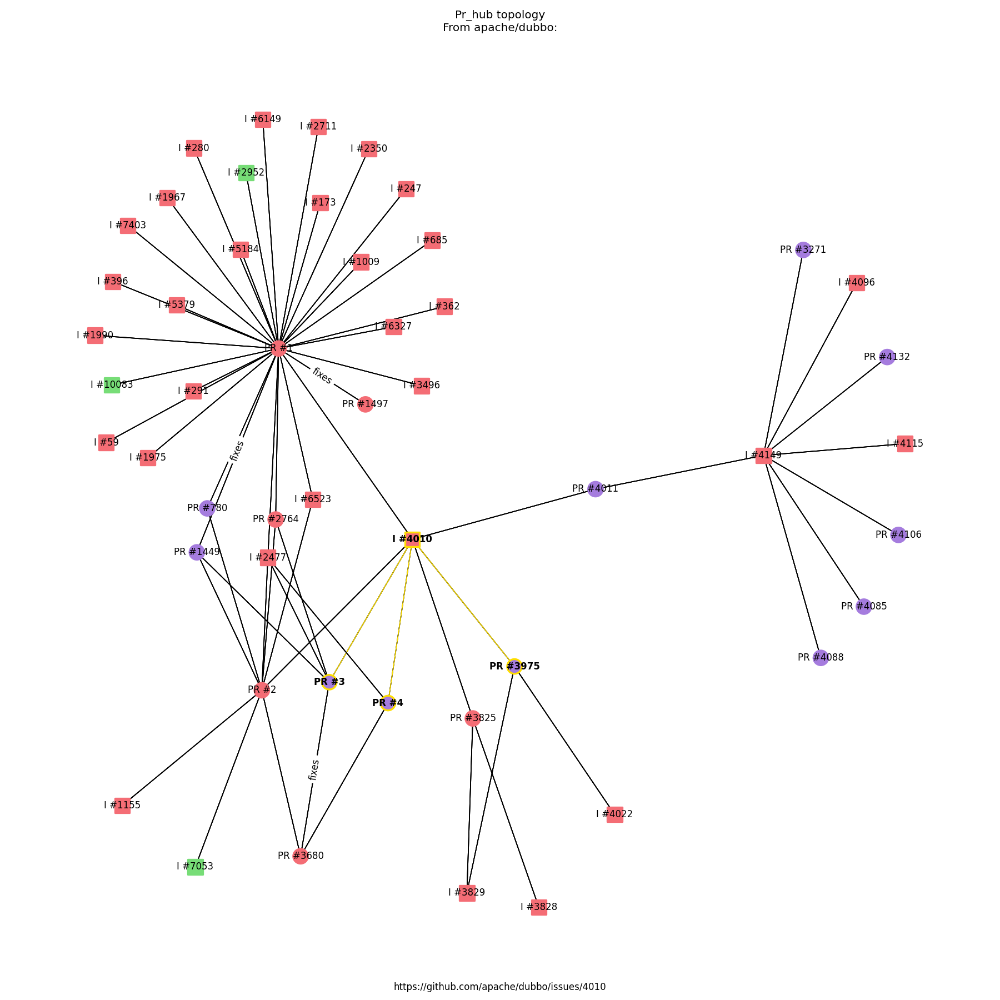
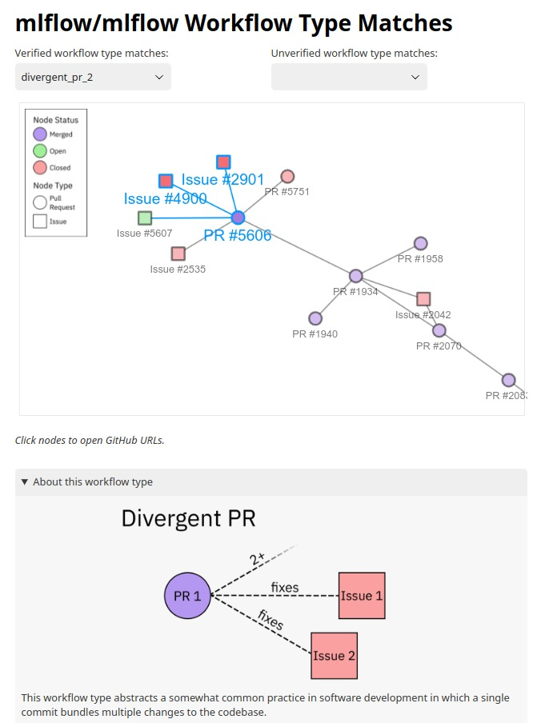

# Revealing Work Practices in Pull-Based Software Development through Issue-PR Graph Topologies

Scripts and data for quantitative analysis in the above paper. The goal of this work is to enable topological analysis of PR-Issue networks on GitHub via graph database queries, an image generation module, and many statistics scripts. [This repository](https://github.com/ubcdlab/pr-issue-topology-project) includes:

- Data scraped from over 50 large open source projects on GitHub and converted into a Neo4j data dump.
- Reusable Cypher (Neo4j query language) queries to surface instances of workflow types.
- Image generation modules written in Python to visualize workflow types and clusters of Issues and PRs, used during the paper's qualitative coding process.
- Interactive web-based project explorer to aggregate workflow types found in a project, used during developer interviews.

These were primarily used to support the qualitative aspects of this paper.

The raw data scraped from GitHub in Summer 2022, including the issues, the PRs, their links, and their comment data, is available as Pickle files, downloadable [here](https://osf.io/29aev/). The OSF dataset also includes the Neo4J database dump as well as all generated workflow type instance images. The raw dataset is 639MB zipped, and the Neo4j dump is 51MB unzipped.

The Cypher queries can be used with the Neo4j query browser to explore the data. Each query specifies the layout of Issues and PRs in the graph structure associated with a workflow type and any constraints (e.g. authorship, creation timestamp) on the nodes involved. These queries can be run by importing the Neo4j data dump into the Neo4j browser and copying over the queries. More information is available in [INSTALL.md](./INSTALL.md).

The image generation modules will generate visualizations of the workflow type instances (highlighted in yellow) in context in their larger cluster of Issues and PRs. Images to visualize instances of a particular workflow type can be generated by running `python -m generate_neo4j_images.generate_from_neo4j --cypher=cypher_scripts/[query].cypher --name=[folder name]`. The results will be saved to the `generate_neo4j_images/images/` folder. More information is available in [INSTALL.md](./INSTALL.md) and an example of a generated image is available below.

The web-based project explorer shows similar information as the image generation modules, but allows users to drag around Issues and PRs and click on them to open their associated GitHub pages. An explanation of the selected workflow type match and its implications is also shown. A pre-built version of the project explorer can be found in `interactive_html/`. Open the folder with a browser and navigate to `index.html` to choose from a list of projects. More information is available in [INSTALL.md](./INSTALL.md) and an example of a project page from the mlflow/mlflow project is shown below.

As well, the scripts used to generate the graphs in the paper (Figures 2, 3, and 4) are [here](./data_scripts). They can be run via `python -m data_scripts.[script name]` and their output images will be generated in `misc_images/`. See [this documentation](./docs/Statistics-Scripts.md) for more information on how to run them.

---

For documentation, see [the `docs/` folder](./docs/). To install the required Python dependencies, run `pip install -r requirements.txt`.

- To get started with the graph database data, see [this documentation](./docs/Neo4J.md).
- To learn more about the image generation module, see [this documentation](./docs/Generating-Topology-Images.md).
- The full database dump is available [here](https://osf.io/3kexy). To import the database in your Neo4J instance, see the [installation guide](./INSTALL.md) or follow the [Neo4J documentation here](https://neo4j.com/docs/aura/auradb/importing/import-database/).
- The Cypher queries are [here](./cypher_scripts/). To run the queries and return the issues and PRs that are part of each workflow type, drag and drop the query over the query GUI.
- The scripts for component sampling are [here](./archive/pipeline/) and additional documentation is [here](https://docs.google.com/document/d/1MWDp3d1xirGBRDDQPGLe2bq1639bEWLQTMzbUCWDdOo/view#heading=h.9q8lgk5wlfct).
